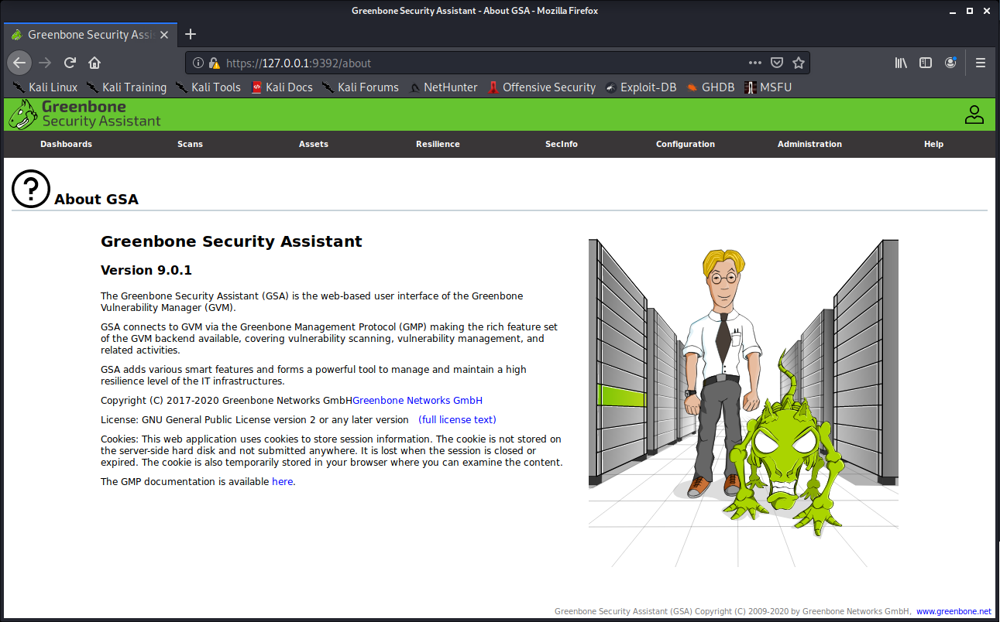
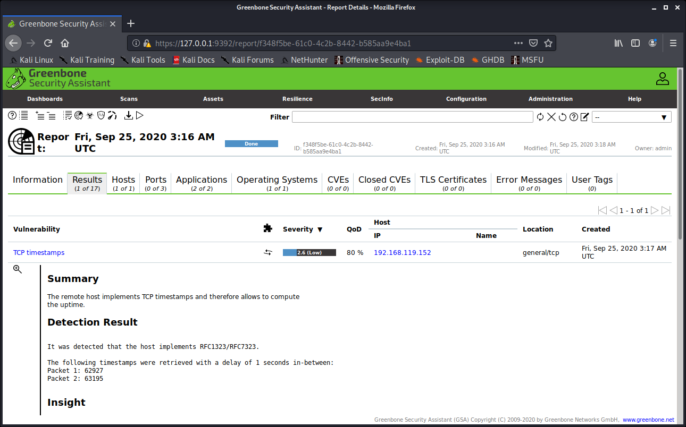

# Отчет

## Задание:

1. Установить OpenVAS в Kali Linux.
2. Установить систему DVL Linux в качестве виртуальной машины, настроить сетевой доступ к ней со стороны Kali Linux и просканировать систему DVL Linux на наличие уязвимостей.
3. \* Установить виртуальную машину на базе Windows 7 (8, 8.1 или 10), активировать сетевой доступ к общим папкам. Просканировать ВМ при помощи OpenVAS с использованием данных протокола SMB.

## Выполнение:

1. Установлен OpenVAS версии 9.0.1

2. Выполнение задания 2

    - Установлен DVL Linux 1.5;
    - Добавлен учетные данные (credentials) в OpenVAS;
    - Добавлен объект сканирования (target) в OpenVAS;
    - Создана и запущена задача сканирования.

### Скриншот отчета сканирования

